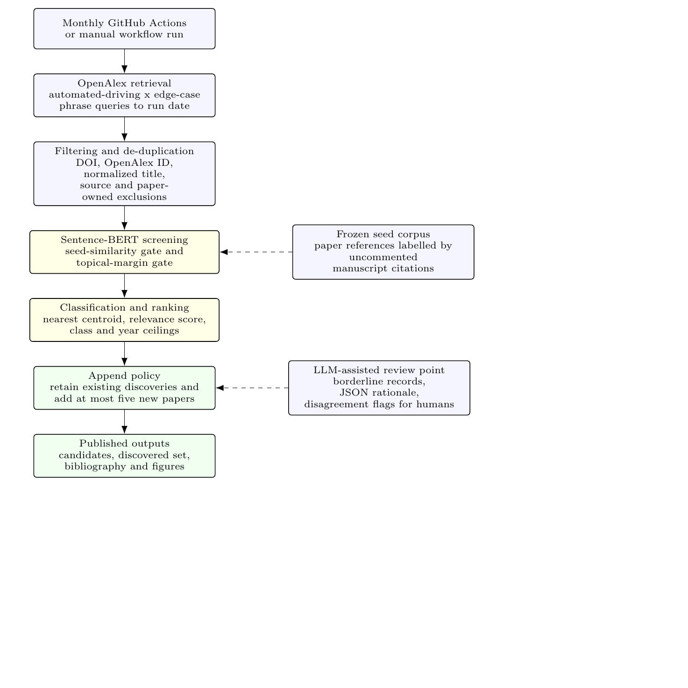
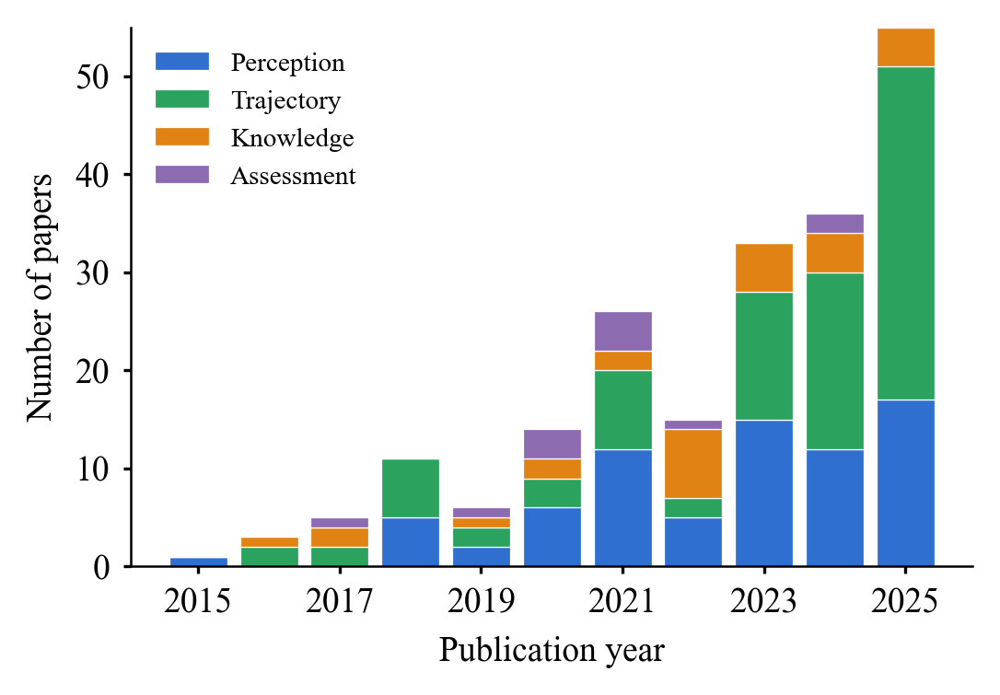
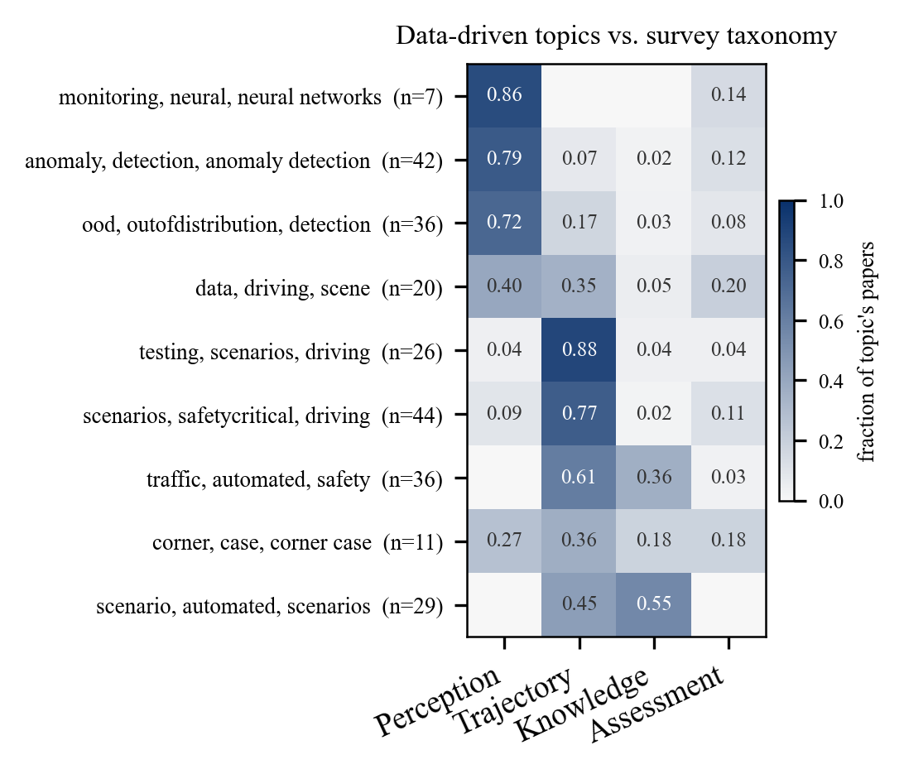
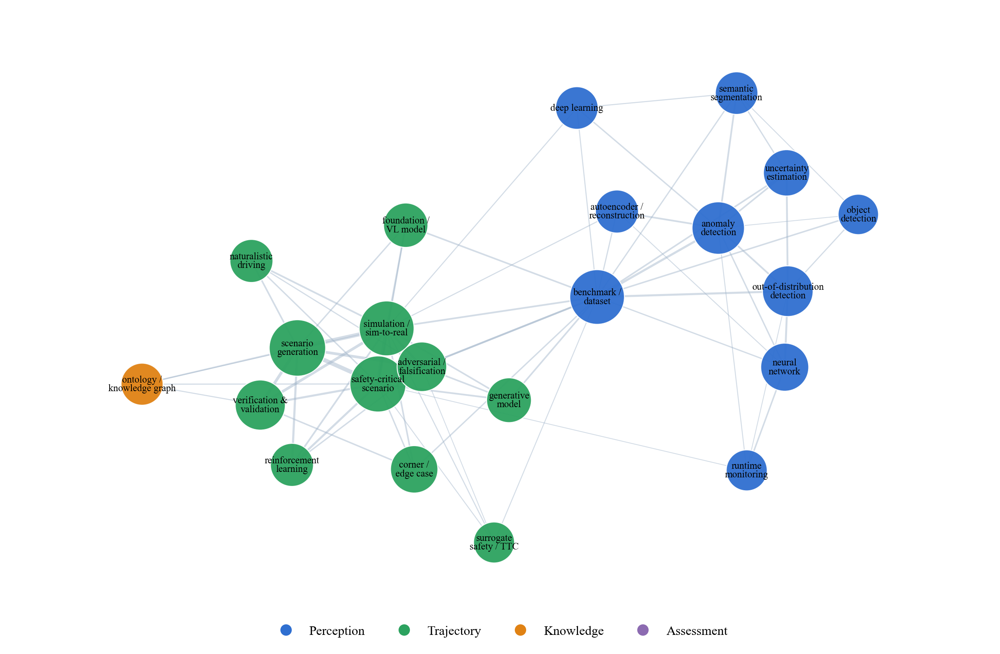
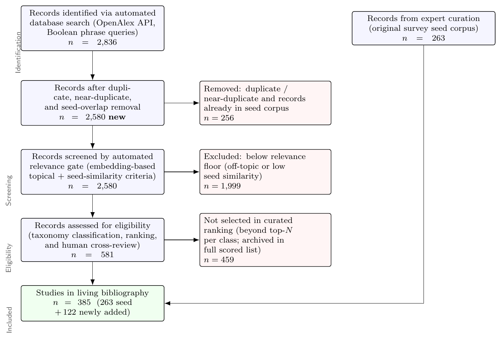

# Living Survey: Edge-Case Detection & Assessment for Automated Driving

A **living, automatically updated companion** to the survey
*"Edge Cases in Automated Driving: A Survey of Detection and Assessment Methods"*.

This repository operationalises the survey's methodology as a reproducible,
semi-automated pipeline. It (1) carries the **expert-curated reference corpus**
of the paper as a frozen *seed*, (2) **discovers new papers** from
[OpenAlex](https://openalex.org) on a schedule, (3) **classifies** every paper
into the survey's top-level taxonomy (*perception-related* /
*trajectory-related* / *knowledge-driven*), and (4) keeps a tightly-screened,
human-reviewable [`BIBLIOGRAPHY.md`](BIBLIOGRAPHY.md) up to date.

The goal is **objectivity, scalability, and replicability**: the literature base
of the survey can be re-derived and extended by anyone, with the expert
synthesis preserved as the seed and the automation acting as a transparent
augmentation — *not* a replacement.

---

## How it works

```
OpenAlex API ──▶ harvest ──▶ de-duplicate ──▶ embed (Sentence-BERT)
                                                     │
    seed corpus (263 source records; 244 canonical works) ──┤
                                                     ▼
                       classify (nearest-centroid, trained on
                        the survey's own section labels)
                                                     ▼
                            ┌──────── two calibrated screening gates ────────┐
                            │ (a) topical relevance margin                    │
                            │     = sim(class centroid) − sim(off-topic)      │
                            │ (b) seed similarity                             │
                            │     = mean cosine to k nearest seed papers      │
                            │ thresholds calibrated from the seed itself      │
                            │ (leave-one-out percentiles)                     │
                            └─────────────────────────────────────────────────┘
                                                     ▼
            rank by relevance-led score, append <=5/month under class/year ceilings
                                                     ▼
                    discovered.csv · candidates_scored.csv · BIBLIOGRAPHY.md
```



**Why two gates and calibration?** Naively searching OpenAlex returns thousands
of loosely-related AV papers. To stay *consistent with the survey's actual
scope* and avoid flooding the bibliography, a candidate must be (a) topically on
the edge-case theme and (b) at least as close to the existing corpus as a
*median paper the authors already cite*. Both thresholds are derived from the
seed corpus by leave-one-out, so the screening is principled and reproducible
rather than hand-picked. The candidate list is then ranked by a relevance-led
score with a modest recency nudge (`recency_weight: 0.01` by default). On the
first run, the pipeline bootstraps the curated living addition to 120 papers.
After that, each monthly refresh **retains the existing selected papers** and
appends at most **five** new papers, still under soft per-class and per-year
ceilings; the full scored list is preserved in `candidates_scored.csv`.

In the most recent run (OpenAlex snapshot through **2026-06-07**): **2,830**
records harvested -> **68** preprint-mill sources, **1** configured source/title
exclusion, and **36** paper-owned seed/reference overlaps dropped; **206**
duplicate or near-duplicate records were also removed -> **2,519** after
de-duplication -> **706** above the relevance floor -> **120** bootstrap curated
additions, merged with the **244**-work canonical seed into a **364**-study living
bibliography (~1.5x the survey corpus). The discovered mix is Trajectory 72 /
Perception 35 / Knowledge 13, with year counts 2023:20 / 2024:32 / 2025:47 /
2026:21. Future monthly runs add at most five more papers that pass the same
gates and ranking rules. The discovered set is intentionally broader and more
recent than the survey itself, which is the point of a *living* companion.
Scientometric figures use a separate cutoff and omit 2026, ending at 2025.

---

## Categories & how they are assigned

| Category | Meaning |
|---|---|
| **Perception-related** | detecting/generating edge cases in sensing & perception (anomaly, OOD, segmentation, …) |
| **Trajectory-related** | safety-critical scenarios, scenario generation, surrogate safety, falsification, … |
| **Knowledge-driven** | expert/ontology/ODD-driven scenario definition & criticality reasoning |
| **Assessment** | metrics & evaluation of detection methods (ground-truth seed category only) |

Categories are **not** guessed from hand-written descriptions. Each *seed* paper
is labelled by the **uncommented citation in the section of the survey that
reviews it** (ground truth; see
[`analysis/section_labels.py`](../analysis/section_labels.py)). The class
prototypes (centroids) of those ground-truth papers then classify newly
*discovered* papers ([`src/classify.py`](src/classify.py)). On the seed this
classifier scores **76% leave-one-out accuracy** (Perception 89% / Trajectory
60% / Knowledge 76%). *Assessment* overlaps the methods it evaluates, so it is
kept as a ground-truth-only seed category and is not an automated target.

---

## Repository layout

```
living-survey/
├── README.md
├── BIBLIOGRAPHY.md            # auto-generated, browsable, grouped by category
├── config.yaml               # search terms + tuning parameters (mirrors src defaults)
├── requirements.txt
├── src/
│   ├── harvest.py            # OpenAlex retrieval (Boolean phrase queries)
│   ├── classify.py          # centroid classifier (trained on the seed's section labels)
│   ├── classify_llm.py      # OPTIONAL modular-LLM second opinion (needs API key)
│   ├── discover.py          # end-to-end: harvest → screen → classify → select → write
│   ├── figures.py           # scientometric figures (trend, heatmap, network)
│   └── report.py            # build BIBLIOGRAPHY.md from the data
├── data/
│   ├── seed_corpus.csv       # 244 canonical seed works + category & label_source
│   ├── discovered.csv        # curated living additions, retained and extended monthly
│   ├── candidates_scored.csv # full scored candidate list (transparency)
│   └── bibliography.csv      # merged seed + discovered, categorised
├── figures/                  # scientometric figures for the LIVING corpus (+ PRISMA)
└── .github/workflows/update.yml   # monthly auto-refresh
```

---

## Quickstart

```bash
python -m venv .venv && source .venv/bin/activate
pip install -r requirements.txt

cd src
python discover.py            # harvest, screen, classify, write data/*.csv
python report.py              # regenerate BIBLIOGRAPHY.md

# inspect the calibration without writing anything:
python discover.py --tune
# force a fresh OpenAlex query (ignore the local harvest cache):
python discover.py --refresh
```

### Tuning

Strictness is controlled in `src/discover.py` (mirrored in `config.yaml`):

| Parameter | Meaning | Default |
|---|---|---|
| `SEED_SIM_PCTL` | seed-similarity floor (percentile of seed LOO distribution) | 50 |
| `MARGIN_PCTL` | topical-relevance floor | 25 |
| `BOOTSTRAP_TARGET` | first-run size of the curated living addition when `discovered.csv` is empty | 120 |
| `MONTHLY_ADD_LIMIT` | maximum number of newly selected papers appended by each later run | 5 |
| `CEILING_FRAC` | soft ceiling: max share of picks from one class | 0.60 |
| `YEAR_CEILING_FRAC` | optional max share of picks from one publication year | 0.40 |
| `RECENCY_WEIGHT` | optional recency bonus per year added to the rank score | 0.01 |
| `MAX_PUBLICATION_DATE` | latest publication date included in the bibliography snapshot; `null` means the run date | null |
| `FROM_YEAR` | earliest publication year to consider | 2023 |

Raise the percentiles for a stricter set, or lower `MONTHLY_ADD_LIMIT` for
slower growth.

### Optional: modular-LLM second opinion

The default classifier runs without any key (Sentence-BERT + calibrated gates +
nearest-centroid taxonomy). For a higher-accuracy audit pass over borderline
(`needs_review`) papers, enable the optional modular LLM layer:

```bash
pip install anthropic
export ANTHROPIC_API_KEY=sk-...
python src/discover.py --no-append
```

Set `use_llm: true` in [`config.yaml`](config.yaml) first. The LLM receives only
bibliographic metadata, title, abstract, and the embedding-based screening
evidence. It returns structured JSON fields (`llm_relevant`, `llm_class`,
`llm_subtopic`, `llm_confidence`, `llm_reason`, plus model/prompt metadata).
High-confidence agreement is recorded as `llm_agrees`; high-confidence
non-relevance or class disagreement is retained as a human-review flag rather
than automatically deleting a paper. Use `--no-append` when you only want to
refresh scores or LLM audit fields for the current bibliography; omit it for the
scheduled monthly update that may append up to five new papers.

---

## Figures

`src/figures.py` regenerates the scientometric figures for **the living corpus**
(seed + discovered) into [`figures/`](figures): a publication-per-year trend, a
BERTopic topic × class heatmap, a curated keyword co-occurrence network, and the
PRISMA flow. A separate static methodology flowchart in
[`figures/methodology_flow_living.tex`](figures/methodology_flow_living.tex)
summarizes the monthly update workflow. The bibliography may include 2026 records, but all scientometric
panels generated with `--trend-max 2025` exclude records after 2025. These are
the repository's *own* figures and are deliberately distinct from the figures in
the paper, which characterise the smaller, fixed survey corpus:

```bash
python src/figures.py --input data/bibliography.csv --outdir figures --trend-min 2015 --trend-max 2025
```

| Publication trend | Topics × taxonomy | Concept co-occurrence |
|:--:|:--:|:--:|
|  |  |  |



## Reproducibility & archival

The living workflow uses the run date by default, so it can keep growing. For a
citable, frozen version (as referenced in the paper), set
`max_publication_date` to a fixed date, run the pipeline, and archive a release
on [Zenodo](https://zenodo.org) to obtain a DOI:

1. Tag a release on GitHub (`v1.0.0`).
2. Enable the repository in Zenodo; a DOI is minted automatically.
3. Cite that DOI in the paper's data-availability statement.

---

## How to cite

If you use this resource, please cite the survey (and, if relevant, the Zenodo
snapshot DOI). The pipeline builds on OpenAlex, Sentence-BERT
(Reimers & Gurevych, 2019), and BERTopic (Grootendorst, 2022).

## License

MIT — see [LICENSE](LICENSE). Bibliographic metadata is sourced from OpenAlex
under CC0.
